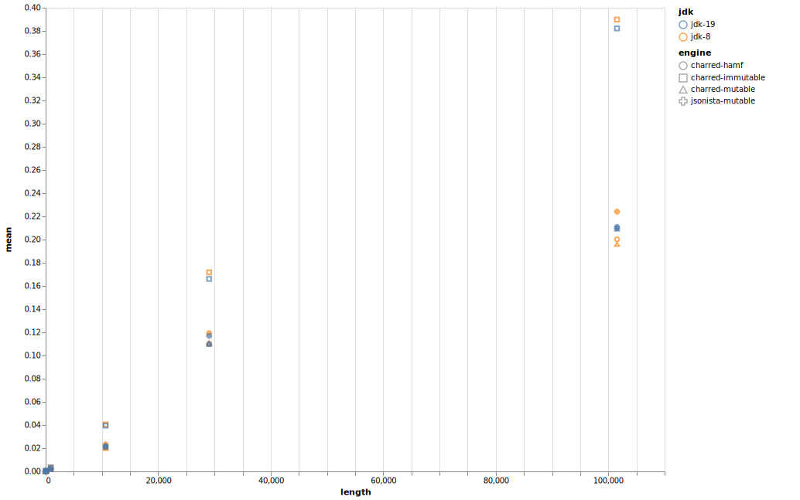

# Simple JSON Benchmarks

I removed clj-json - it is too far out of range of everything else and thus is compressing the rest of the benchmarks.  Running all the benchmarks on my computer kicks off the heat management system and everything slows down considerably.  Here are the some average benchmarks for jdk-19:

```clojure
;;  Startup: /usr/local/bin/clojure -A:dev -Sdeps '{:deps {nrepl/nrepl {:mvn/version "1.0.0"} cider/cider-nrepl {:mvn/version "0.28.5"}} :aliases {:cider/nrepl {:main-opts ["-m" "nrepl.cmdline" "--middleware" "[cider.nrepl/cider-middleware]"]}}}' -M:cider/nrepl
user> 
fjson> (crit/quick-bench ((parse-fns :charred-mutable) (testfiles "test100k.json")))
Execution error (IllegalArgumentException) at charred.api/->reader (api.clj:53).
Cannot open <nil> as a Reader.
fjson> (crit/quick-bench ((parse-fns :charred-mutable) (testfiles "json100k.json")))
Evaluation count : 1986 in 6 samples of 331 calls.
             Execution time mean : 304.532701 µs
    Execution time std-deviation : 1.264856 µs
   Execution time lower quantile : 303.399991 µs ( 2.5%)
   Execution time upper quantile : 306.539971 µs (97.5%)
                   Overhead used : 2.013357 ns

Found 1 outliers in 6 samples (16.6667 %)
    low-severe     1 (16.6667 %)
 Variance from outliers : 13.8889 % Variance is moderately inflated by outliers
nil
fjson> (crit/quick-bench ((parse-fns :jsonista-mutable) (testfiles "json100k.json")))
Evaluation count : 1602 in 6 samples of 267 calls.
             Execution time mean : 394.156235 µs
    Execution time std-deviation : 18.952032 µs
   Execution time lower quantile : 377.061232 µs ( 2.5%)
   Execution time upper quantile : 415.474933 µs (97.5%)
                   Overhead used : 2.013357 ns
nil
```





* [source code](src/fjson.clj)
* [JDK-8 results](jdk-8.edn)
* [JDK-19 results](jdk-19.edn)

